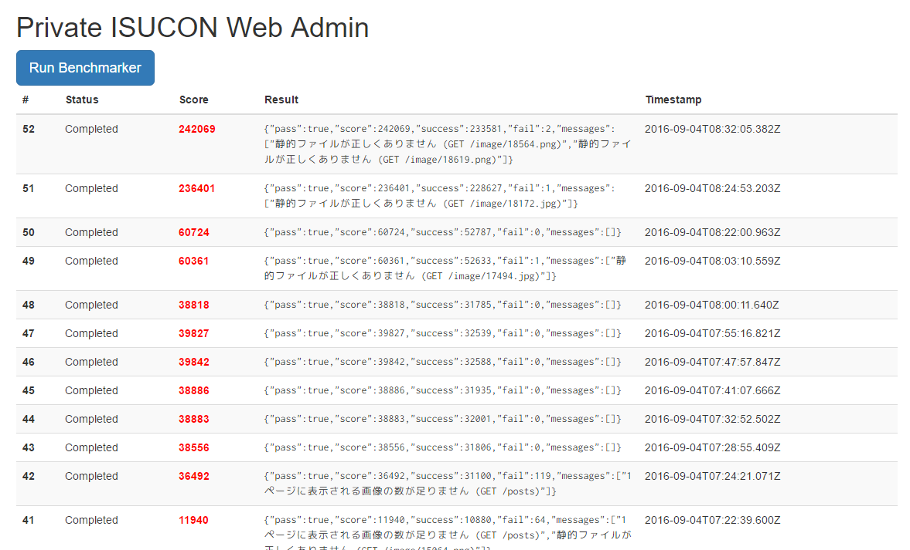

# benchmarker-webapp

[](https://greenkeeper.io/)



[pixivの社内ISUCON](https://github.com/catatsuy/private-isu)のポータルサイトの簡易実装です。ソロプレイ専用。

ベンチマークの起動と終了をSlackに通知します。

## 起動方法

ベンチマーカーのAMIを立ち上げて、以下のコマンドを打つと3000番ポートでポータルサイトが立ち上がる気がする。

```sh
sudo apt-get install sqlite3 -y
wget -qO- https://raw.githubusercontent.com/creationix/nvm/v0.31.7/install.sh | bash
source ~/.bashrc
nvm install 6
npm install forever -g
git clone https://github.com/hakatashi/benchmarker-webapp.git
cd benchmarker-webapp
npm install
sqlite3 db.sqlite3 'create table executions(id integer PRIMARY KEY AUTOINCREMENT, status integer, score integer, result text, timestamp integer)'
SLACK_WEBHOOK_URL=https://hooks.slack.com/services/xxxxxxxxxxxxxxxxxxxxxx WEBAPP_IP=xxx.xxx.xxx.xxx forever start -c "npm start" .
```
